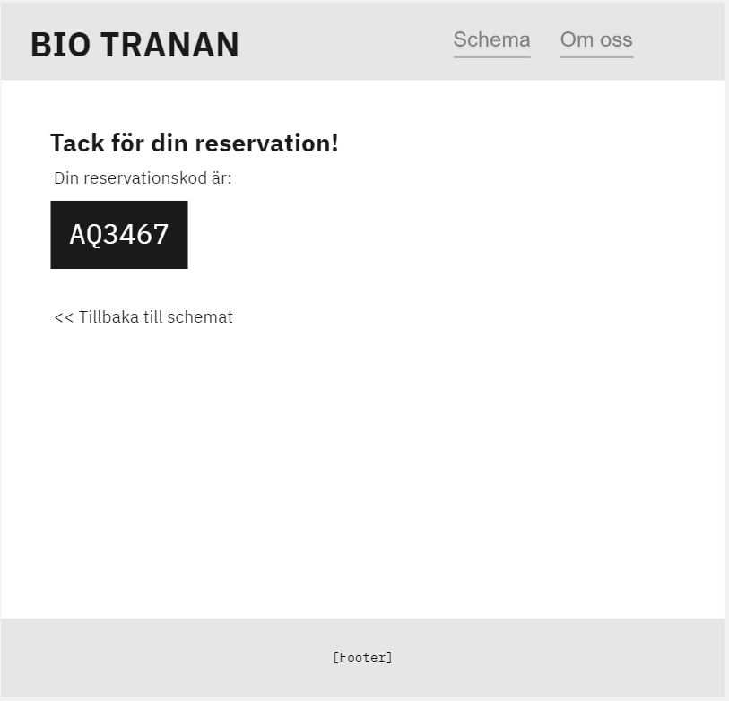

# BioTranan
Obligatorisk **självständig** inlämningsuppgift för BY-SUVNET OOP2
### Inlämning: 20 april kl 09.00
### Betygsgränser
För G
* Minst 3 av 3 krav för hemsidan
* Minst 6 av 7 krav för REST-APIet
* Minst 2 av 3 systemregler

För VG
* Viktigare med en övergripande bra struktur på koden
* Samtliga G-krav
* Minst 5 av 7 extrakrav

**Viktigt!** Se till att kryssa i alla krav du lyckats med. Sätt bara ett x innanför [ ] i denna readmefil så bockas de i.
**OBS: Det kan tillkomma något krav halvvägs in i projektet :o **

----
## Uppgiftsbeskrivning
Du har fått i uppdrag att ta fram Bio Tranans nya hemsida! Bio Tranan är en liten ideelt driven biograf som visar ett mindre antal filmer.

Bio Tranan vill ha två saker, dels en publik hemsida där besökare skall kunna:
- [x] Se schemat för kommande visningar
- [x] Reservera platser på visningar
- [x] Få grundläggande information om filmerna som ska visas

Utöver detta vill Bio Tranan, som drivs av erfarna utvecklare, ha ett REST API som kan fungera som administationsverktyg (i framtiden tänkte de skriva sin egen frontend för detta). REST API:et skall kunna:
- [x] Lägga till nya filmer
- [x] Ta bort filmer
- [x] Lägga till nya salonger med ett visst antal platser
- [x] Lägga till nya visningar i schemat
- [x] Hämta hem schemat för alla visningar
- [x] Lista alla reservationer
- [x] Lista alla reservationer för en viss visning

Regler för systemet:
- [x] En film får bara visas ett visst antal gånger. Det skall alltså inte gå att lägga till en film i schemat för visningar, om den redan visats max antal gånger.
- [x] Det ska inte gå att lägga till en filmvisning i schemat samma tid som en annan film visas i en viss salong
- [x] Det skall inte gå att reservera platser på en visning om det inte finns tillräckligt många platser kvar

## Utöver dessa krav finns några extra VG-krav

Hemsidan:
- [x] Visa det totala priset innan reservationen läggs (se bild)
- [x] Det skall gå att avboka en reservation
- [x] Använd ett externt api till något på hemsidan, exempelvis ett random advice från https://api.adviceslip.com/, eller mer avancerat: https://developers.themoviedb.org/3/getting-started/introduction
- [x] Reviews! Det skall gå att poängsätta filmer samt ge dem ett skriftligt omdöme genom att ange sin reservationskod, men bara efter att filmen visats.

REST-API
- [x] Skapa en ny reservation
- [x] Det skall gå att lägga tillfälliga platsrestriktioner på en viss visning, utifall det blir nya pandemi-regler i höst
- [ ] Kräv autentisering för att kunna användas (Valfri metod)

Regler för systemet:
- [x] Ta bort reservationer automatiskt ur databasen när de inte längre är giltiga

## Systemet
Hur du väljer att strukturera denna uppgift är upp till dig, men du måste givetvis använda ASP.Net. Exempel: 
* Monolitisk applikation i MVC, med REST API:et i samma projekt.
* Blazor WASM som frontend och ett enda REST API som backend
* Blazor Server med frontend-specifik funktionalitet och ett separat REST API specifikt för admins.

## Databas
Använd antingen InMemory eller SQLite. Använder du InMemory är det extra viktigt att du seedar din databas så att jag kan testa projektet när det är inlämnat utan att behöva lägga in data först. Titta till exempel hur detta är gjort i eShopOnWeb.

## Tips
* **Angrip projektet lugnt och metodiskt! Gör inte allt på en och samma gång!**
* Läs kravspecen och analysera vilka objekt du kommer behöva. Minns våra tidigare övningar där vi analyserade vilka substantiv och verb som fanns med i beskrivningarna.
* Det är ok att ni skapar extra endpoints och klasser än de som finns beskrivna här, men detta är nuvarande minimumkrav
* Tänk på att kunden må vara en van beställare av datasystem, men kraven kan ändå vara lite otydligt formulerade. Det går att ställa öppna  förtydligande frågor i Fråge-kanalen på Discord! 

## Checklista för inlämning

- Jag har tagit bort onödig/oanvänd kod
- Jag har tagit bort onödiga kommentarer
- Jag har formaterat min kod fint
- Jag har förstått vad min kod gör (mer eller mindre). Prova att försöka förklara högt för dig själv vad din kod gör. Ställ frågor som "Hur går det till när jag lägger till en film?" "Vad händer om jag försöker reservera 2000 biljetter på en visning?"
- Jag har checkat av vilka funktionskrav jag anser att jag klarat genom att skriva **[JA]** eller **[NEJ]** efter dem i README.md

